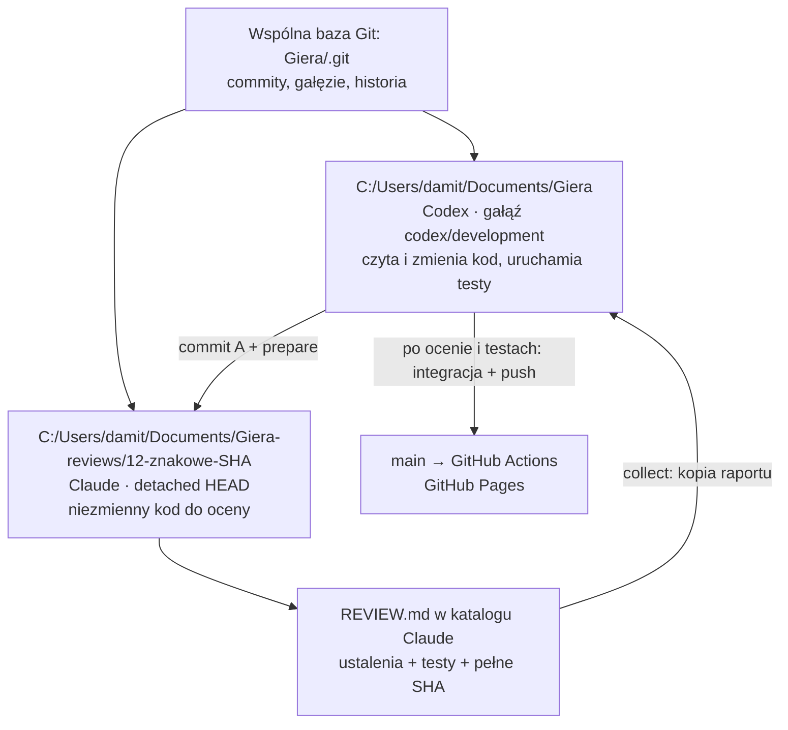
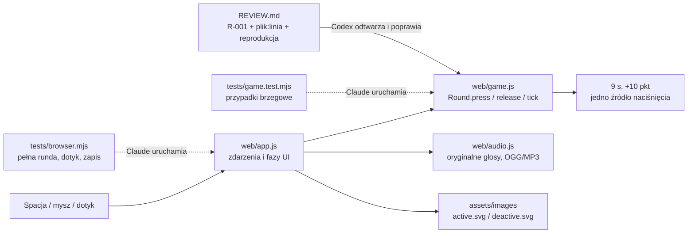
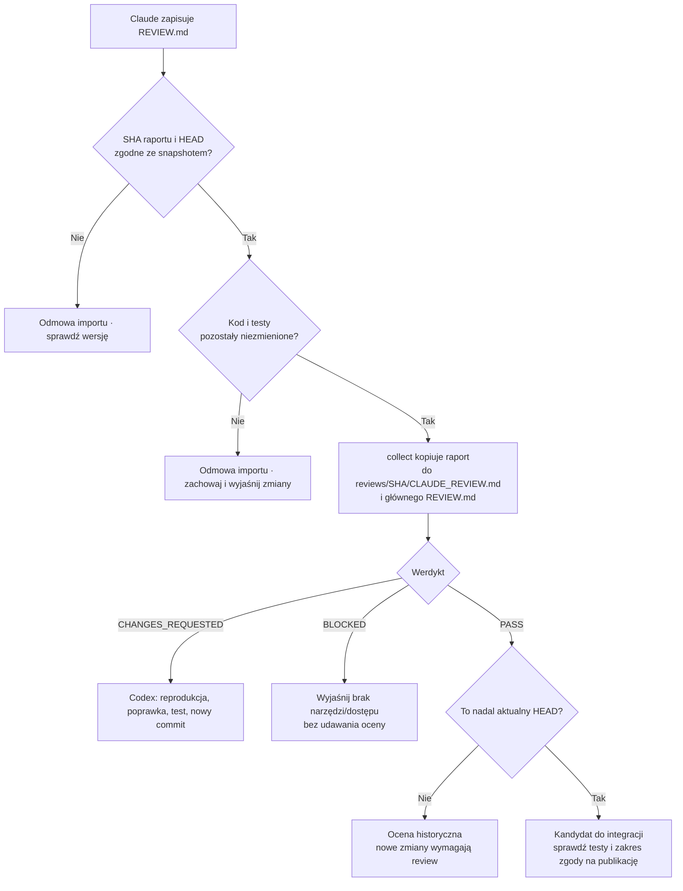

# Codex pisze. Claude testuje. Git pilnuje wersji.

To konfiguracja tego repozytorium, a nie hipotetyczny przykład. Przygotowanie
snapshotu i odebranie oceny obsługuje `scripts/review_worktree.py`. Skrypt nie
wywołuje modeli, nie łączy gałęzi i nie publikuje strony. Osobno uruchamiasz
Claude Code, który korzysta ze swojej sesji i uprawnień.

## 1. Gdzie kto pracuje



`Giera` już jest głównym worktree Git. Nie trzeba kopiować go do trzeciego
katalogu. Dodatkowy worktree Claude'a ma własne pliki i indeks, lecz wspólną
historię. Zmiana w pliku `Giera/web/game.js` nie zmienia odpowiednika w katalogu
Claude'a. `venv`, `node_modules`, `build` i lokalne dane nie są współdzielone.

Claude ma detached HEAD: ogląda konkretny commit, nie ruchomą gałąź. Kolejna
recenzja nowego commita trafia do nowego folderu. Nie przestawiaj starego
worktree podczas pracy testera. `git worktree lock` chroni rejestrację przed
przypadkowym usunięciem/przeniesieniem; nie blokuje edycji plików.

## 2. Kolejność pracy

```mermaid
sequenceDiagram
    participant C as Codex / Giera
    participant G as Git
    participant T as Claude / osobny worktree
    participant R as Raport z SHA
    C->>C: Przeczytaj kontekst, popraw game.js/app.js
    C->>C: npm test + test przeglądarki
    C->>G: Commit A
    C->>G: review_worktree.py prepare --base BASE
    G->>T: Snapshot A + wymagania + różnica kodu
    T->>T: Własna analiza i uruchomienie testów
    T->>R: CHANGES_REQUESTED, SHA A, R-001
    C->>R: review_worktree.py collect
    C->>C: Reprodukcja R-001 + poprawka + test regresji
    C->>G: Commit B
    C->>G: prepare --base A
    G->>T: Nowy snapshot B w nowym folderze
    T->>R: PASS, SHA B, dowody testów
    C->>R: collect; sprawdź current=true
    C->>G: Integracja dokładnie B do main
    G->>G: Actions: testy i publikacja Pages
```

Codex może w czasie recenzji A pracować nad następnym zadaniem. Wtedy raport A
dotyczy wyłącznie A. Skrypt pokaże `current: false`, jeśli HEAD autora już się
zmienił. Nie zamieniaj tego na PASS dla B. Przy niewielkim projekcie najprościej
po oddaniu A wstrzymać zmiany tego samego fragmentu do zakończenia oceny.

## 3. Konkretne pliki z gry



Przykład edukacyjny, **nie stwierdzony błąd obecnej wersji**: Claude podejrzewa,
że puszczenie spacji po dziewiątej sekundzie dodaje punkty.

1. Czyta `Round.release` i `Round.tick` w `web/game.js`.
2. Odtwarza granicę czasu (np. start 1000 ms, puszczenie 10000 ms).
3. Uruchamia test `deadline is exactly 9000ms...` w `tests/game.test.mjs`.
4. Jeżeli problem rzeczywiście występuje, zapisuje R-001 z wartościami i wynikiem.
5. Codex sprawdza zgłoszenie. Naprawa należy do autora; tester nie zmienia kodu
   podczas audytu. Obecna implementacja już sprawdza deadline przed punktowaniem.

Przykład rzeczywistego zakresu do zbadania: `web/app.js` obsługuje przycisk akcji
i zapobiega niezamierzonemu restartowi przy puszczeniu go po końcu rundy.
`tests/browser.mjs` przytrzymuje ten przycisk przez granicę czasu i sprawdza wynik.
Claude może sprawdzić także anulowanie dotyku, zmianę karty i szybkie kolejne rundy.

## 4. Konfiguracja i komendy autora

Pracuj w `C:\Users\damit\Documents\Giera`, na `codex/development`.
Obecna publikacja została przygotowana przed ustaleniem tego obiegu; kolejne
zmiany powinny przechodzić recenzję przed integracją do `main`.

```powershell
cd C:\Users\damit\Documents\Giera
git status --short
git branch --show-current
# Oczekiwane: codex/development

npm test
python scripts/build_web.py
$env:BROWSER_CHANNEL='msedge'
npm run test:browser

# Po zakończeniu zmian: dodaj konkretne zmienione pliki i zrób commit.
git add web/game.js tests/game.test.mjs HANDOFF.md
git commit -m "Fix round deadline handling"

# Snapshot bieżącego commita; BASE zastąp pełnym SHA poprzedniej oceny.
python scripts/review_worktree.py prepare --base BASE
```

Pierwsza recenzja zmian całej edycji 02 używa bazy
`ccee21d8b1ef02357d22bd244c6da9a3ec8666eb`. `prepare` bez `--base` porównuje
z rodzicem ocenianego commita, co nie zawsze obejmuje całą wielocommitową zmianę.
Skrypt wymaga czystego drzewa: nie zamrozi niezatwierdzonej połowy pracy.

Wynik `prepare` zawiera dokładne ścieżki. Aktualny lokalny zestaw odczytasz:

```powershell
$reviewSession = Get-Content .reviews/latest.json -Raw | ConvertFrom-Json
$reviewSession | Format-List
git worktree list
```

## 5. Konfiguracja Claude'a

`prepare` tworzy **wyłącznie w nowym worktree**:

| Plik | Rola |
| --- | --- |
| `.review/session.json` | pełne SHA, baza i katalogi |
| `.review/changes.patch` | różnica do oceny, bez kopii rozmowy autora |
| `.review/REVIEW_PROMPT.md` | konkretne wymagania i zlecenie dla testera |
| `.claude/settings.local.json` | uprawnienia tej recenzji, Edge na Windows |
| `.review/START_CLAUDE.ps1` | uruchomienie CLI z promptem testera |
| `REVIEW.md` | jedyny plik śledzony edytowany przez testera |

Konfiguracja zezwala na czytanie, określone komendy testowe oraz edycję raportu.
Reguły odmawiają edycji kodu przez narzędzia Edit/Write i operacji publikacji Git.
Pozostawia zwykły tryb uprawnień — bez `bypassPermissions` i bez
`dangerously-skip-permissions`. Nie zmienia ustawień globalnych, modelu ani konta.
Zaufanie do nowego folderu trzeba potwierdzić w Claude Code, jeśli program o nie poprosi.

To ograniczenie ról i kontrola przypadkowych zmian, **nie sandbox systemu
operacyjnego**. Shell, testy i wspólny Git mogą zapisywać pliki. Dlatego `collect`
dodatkowo sprawdza, że HEAD i kod testera nadal odpowiadają ocenianemu commitowi.

Przed pierwszym uruchomieniem testów w snapshotcie:

```powershell
cd C:\Users\damit\Documents\Giera
$reviewSession = Get-Content .reviews/latest.json -Raw | ConvertFrom-Json
Set-Location -LiteralPath $reviewSession.worktree
npm ci --ignore-scripts
# Windows: używamy zainstalowanego Edge.
$env:BROWSER_CHANNEL='msedge'
# Linux/macOS: npx playwright install chromium, bez BROWSER_CHANNEL.
```

**Claude Code w aplikacji:** otwórz jako projekt folder wypisany w `worktree`,
rozpocznij nową sesję i wklej:

> Jesteś niezależnym testerem. Przeczytaj `.review/REVIEW_PROMPT.md`, wykonaj
> recenzję wskazanego commita i zapisz `REVIEW.md`. Nie poprawiaj kodu.

**Claude Code CLI**, jeżeli polecenie `claude` jest dostępne:

```powershell
& .\.review\START_CLAUDE.ps1
```

Przygotowany folder już jest worktree. Nie dodawaj tutaj `claude --worktree`,
bo utworzyłoby kolejną kopię. Nie wznawiaj starej rozmowy związanej z aktywnym
katalogiem Codexa bez odczytania nowego promptu i aktualnych plików.

W tej konfiguracji nie instalujemy Claude Code ani nie logujemy za użytkownika.
Brak programu `claude` w PATH nie przeszkadza w użyciu projektu przez aplikację.
Jeśli Twoja aplikacja nie pozwala wybrać lokalnego katalogu, potrzebujesz
Claude Code CLI/rozszerzenia z dostępem do tego worktree — zwykły czat bez
dostępu do plików nie wykona lokalnych testów.

## 6. Jak wraca raport i poprawki



Po zakończeniu Claude'a, w katalogu Codexa:

```powershell
cd C:\Users\damit\Documents\Giera
python scripts/review_worktree.py collect
```

Nagłówek raportu (pełne SHA skrypt wpisuje do szablonu):

```text
Reviewed-Commit: PEŁNE_40_ZNAKOWE_SHA
Verdict: CHANGES_REQUESTED
Reviewer: Claude Code

R-001 | P2 | web/game.js:linia | opis | reprodukcja | oczekiwane zachowanie
```

Skrypt nie nadpisze innego wcześniejszego raportu ani niezapisanych zmian autora
w REVIEW.md. Pomyślny import nie uruchamia poprawek: daj Codexowi polecenie
„Przeczytaj REVIEW.md, sprawdź R-xxx, popraw potwierdzone błędy i oddaj nowy commit
do recenzji”. Odpowiedzi autora zapisuj w HANDOFF.md lub osobnym pliku w folderze
danego raportu; zachowaj oryginalne ustalenia Claude'a.

## 7. Publikacja i granice automatyzacji

Po PASS sprawdź, czy kod nie zmienił się od ocenionego SHA. Raport i aktualizacje
notatek mogą być zapisane osobnym commitem; zbadaj `git diff OCENIONE_SHA HEAD`.
Zmiany samej dokumentacji nie są oceną nowych zmian gry. Przy zmianach kodu
wymagana jest kolejna recenzja.

Integrator (Codex) po poleceniu publikacji i udanych testach może wykonać:

```powershell
git switch main
git merge --ff-only codex/development
git push origin main
git switch codex/development
```

`--ff-only` zatrzyma integrację, jeśli gałęzie się rozeszły. Nie naprawiaj tego
force-pushem. Najpierw zintegruj zmiany na gałęzi deweloperskiej, uruchom testy
i oddaj wynik do oceny. Claude nigdy nie wykonuje tego kroku.

Pętla jest na razie jawna: prepare → uruchomienie Claude → collect → poprawki.
Bez samoczynnego budzenia modeli i bez nieograniczonych pętli API. Dzięki temu
obaj agenci mają jasną odpowiedzialność, a zużycie limitów pozostaje kontrolowane.

## Źródła konfiguracji

- [Codex: AGENTS.md](https://learn.chatgpt.com/docs/agent-configuration/agents-md)
- [Codex: worktree](https://learn.chatgpt.com/docs/environments/git-worktrees)
- [Claude Code: CLI, worktree i prompt z pliku](https://code.claude.com/docs/en/cli-reference)
- [Claude Code: lokalne ustawienia i uprawnienia](https://code.claude.com/docs/en/settings)
